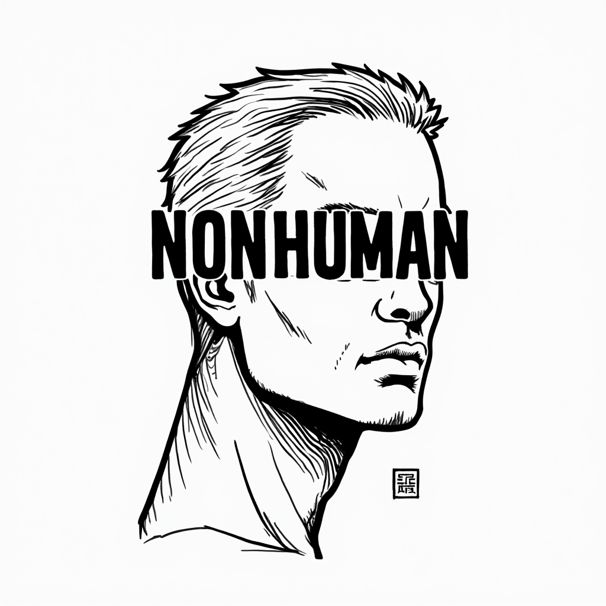

# NONHUMAN-WEB



## 1. Descripción
Este repositorio contiene el código fuente de la página oficial de [NONHUMAN](https://nonhuman.com). Es un proyecto web que puede ejecutarse y desarrollarse utilizando `npm run dev`.

## 2. To Do:
- [ ] Filtrar los comentarios de las partes del código para que no las cuente como headers en markdown.
- [ ] Asegurar que el bold en los headers sea automático para renderizar correctamente el markdown.
- [ ] Asegurar que el markdown sea renderizado correctamente en el servidor.
- [ ] Pensar en cómo renderizar el Mermaid, si de forma local o si de forma externa.
- [ ] Agregar la parte del lenguaje en los markdowns

- [ ] En Katex, arreglar el problema de que no se renderice correctamente la ecuación en el markdown. Específicamente no se renderiza bien la parte \sqrt{}. Tal vez debemos de usar otro paquete como MathJax.

## 3. Características principales
El componente más importante de este proyecto es el **renderizador de Markdown**, el cual permite interpretar y estructurar contenido escrito en formato Markdown con algunas personalizaciones adicionales.

### 3.1 Sintaxis de Markdown personalizada
Para garantizar que el formato de Markdown sea interpretado correctamente, es importante seguir las siguientes reglas:

#### 3.1.1 Código
Para resaltar fragmentos de código, se debe iniciar con triple tilde (` ``` `) seguido del lenguaje de programación a renderizar. Por ejemplo:

```python
print("Hola, mundo!")
```


#### 3.1.2 Imágenes y videos con tamaño personalizado
Para insertar imágenes con un tamaño definido, utilizamos la siguiente sintaxis:

```markdown

```

Donde:
- `titulo_imagen` es el texto alternativo de la imagen.
- `longitud` es el tamaño deseado de la imagen.
- El enlace de la imagen debe ser un **URL público accesible**.

#### 3.1.3 Estructuración basada en encabezados
Nuestro renderizador también estructura automáticamente el contenido en base a los encabezados definidos en Markdown:
- `# Encabezado 1` (h1)
- `## Encabezado 2` (h2)
- `### Encabezado 3` (h3)
- Y así sucesivamente...

Esto permite una organización clara y jerárquica de la información dentro del contenido renderizado.

#### 3.1.4 Slugify
Para asegurar que los encabezados sean únicos y estén correctamente referenciados, se utiliza la función `slugify` en el componente `MarkdownRenderer`.

> ⚠️ **Alerta:** Los títulos y sub-títulos deben ser únicos y además, no pueden contener tildes para que funcione bien el sidebar de los wikis.

#### 3.1.5 Mermaid
* Para los diagramas de mermaid debemos de utilizar el formato HTML para que se renderice correctamente.
* Además de que se debe de cumplir que el diagrama de mermaid debe de estar dentro de un div con la clase `mermaid`.
* Al final de cada elemento de mermaid se debe de agregar un `;` para que se renderice correctamente.
* No deben de existir saltos de línea en el diagrama de mermaid, ya que esto puede causar errores.

Un pequeño ejemplo de cómo se debe de escribir el diagrama de mermaid en HTML:

```html
<div class="mermaid">
    graph TD;
    subgraph "Tokenization";
    A[Input Text] --> B[BasicTokenizer];
    B --> |Convert characters to tokens| C[Token Sequence];
    C --> |Convert to tensor| D[Input Tensor idx];
    end;
    subgraph "Embedding";
    D --> E[Token Embedding Table];
    E --> |Embed tokens| F[Token Embeddings];
    G[Positional Encoding] --> |Add position info| F;
    end;
    subgraph "Transformer Blocks";
    F --> H[Multi-Head Attention];
    H --> |Compute Attention| I[Self-Attention Layer];
    I --> |Key, Query, Value Projections| J[Attention Computation];
    J --> |Masked Softmax| K[Attention Probabilities];
    K --> |Weighted Aggregation| L[Attention Output];
    L --> M[Feed Forward Network];
    M --> |Non-linear Transformation| N[Residual Connections];
    N --> O[Layer Normalization];
    end;
    subgraph "Prediction";
    O --> P[Language Model Head];
    P --> |Convert to Logits| Q[Softmax];
    Q --> |Probability Distribution| R[Token Sampling];
    R --> |Select Next Token| S[Generated Token];
    S --> |Append to Sequence| T{Continue Generation?};
    T -->|Yes| D;
    T -->|No| U[Final Output Text];
    end;
</div>
```


## 4.Instalación y ejecución
Para ejecutar el proyecto en un entorno local:

```sh
npm install
npm run dev
```

### ¿Cómo agregar un nuevo wiki?

La estructura está determinada por la carpeta `public/wiki`. Entonces dentro de esta carpeta se debe crear una carpeta con el nombre del wiki, y dentro de esta carpeta se deben crear los archivos en formato JSON que tenga el siguiente formato:

```json
{
    "es":{
        "title":"",
        "description":"",
        "authors":"",
        "date":"",
        "url":""
    },
    "en":{
        "title":"",
        "description":"",
        "authors":"",
        "date":"",
        "url":""
    }
}
```

donde 'url' es la ruta relativa al archivo markdown que contiene el contenido del wiki. Esta puede ser interna si se encuentra en public/wiki o externa si se encuentra en alguna url externa.

## Contacto
Para cualquier consulta o duda sobre este proyecto, puedes enviarme un correo a **leo.perez.nestares@gmail.com**.

---

¡Gracias por contribuir a NONHUMAN-WEB!

