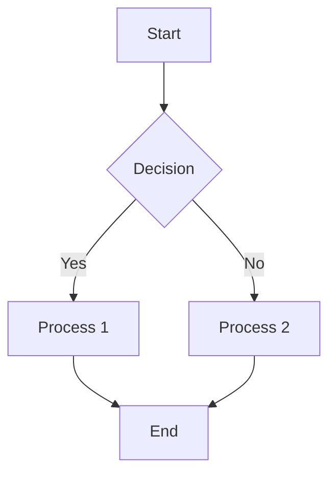
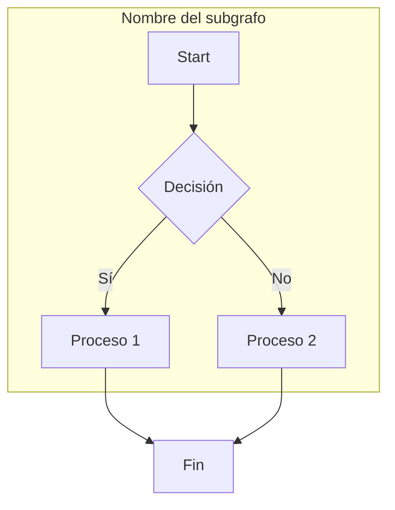
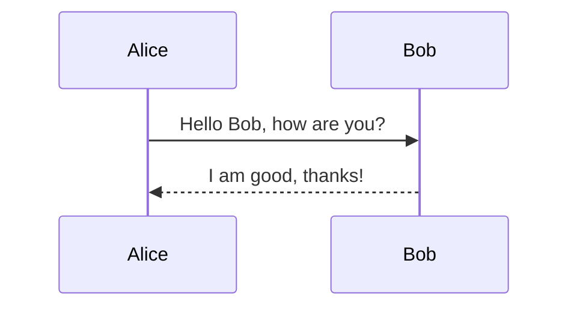
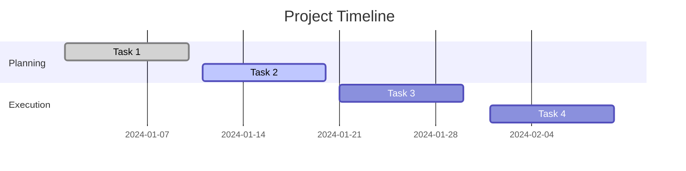

# Markdown Test File

## h2 Header

### h3 Header

---

## Formatting Styles

**Bold text**

*Italic text*

~~Strikethrough~~

> This is a blockquote. It can span multiple lines and is useful for emphasizing important content.

Lorem ipsum dolor sit amet, consectetur adipiscing elit. Nulla nec posuere lorem, vel facilisis metus. Integer feugiat auctor lacus, in vulputate justo condimentum non. Vestibulum ante ipsum primis in faucibus orci luctus et ultrices posuere cubilia curae.

---

## Lists

### Unordered List
- Item 1
- Item 2
  - Subitem 2.1
  - Subitem 2.2
- Item 3

### Ordered List
1. First item
2. Second item
   1. Subitem 2.1
   2. Subitem 2.2
3. Third item

Lorem ipsum dolor sit amet, consectetur adipiscing elit. Cras ultricies leo ac nunc dignissim, sit amet molestie risus tempor. Aliquam erat volutpat. Mauris aliquet sem in enim fermentum, id scelerisque justo facilisis.

### Task List
- [x] Completed task
- [ ] Pending task
- [ ] Another task

---

## Tables

| Column 1 | Column 2 | Column 3 |
|----------|----------|----------|
| Data 1   | Data 2   | Data 3   |
| Data A   | Data B   | Data C   |

Phasellus tincidunt ex ut eros ultricies, et sagittis ipsum euismod. Sed eget lectus nec nunc sodales tristique. Duis eget purus vel est interdum condimentum.

---

## Code Blocks

### Inline Code
Use `print("Hello, World!")` to print a message in Python.

### Python Code Block
```python
import numpy as np

def compute_square_matrix(n):
    return np.array([[i * j for j in range(n)] for i in range(n)])

print(compute_square_matrix(5))
```

Programming is an essential skill in modern times. Python is a versatile language that can be used for various applications, including data science, machine learning, and web development. Writing clean and efficient code is a crucial skill for any developer.

---

## Links and Images

### Hyperlink
[Visit OpenAI](https://openai.com)

### Image


Images can be used to enhance documentation by providing visual representation of concepts. They help improve readability and understanding, making technical content more accessible to a wider audience.

---

## Horizontal Rules

---

---

## Math Equations

Inline equation: $E = mc^2$

Block equation:

$$
\sum_{i=1}^{n} i = \frac{n(n+1)}{2}
$$

Mathematical notation is crucial in scientific and engineering disciplines. Using LaTeX-style equations in Markdown allows clear and accurate representation of formulas and computations.

---

## Footnotes

This is an example of a footnote reference.[^1]

[^1]: This is the footnote text.

---

## HTML Elements

<details>
  <summary>Click to expand</summary>
  Hidden content revealed!
</details>

Interactivity in Markdown can be enhanced using HTML elements such as expandable sections. This allows users to reveal additional information only when needed, keeping documents concise and readable.

## HTML 2

<!DOCTYPE html>
<html lang="es">
<body>
    <div class="mermaid">
    graph TD;
        A-->B;
        A-->C;
        B-->D;
        C-->D;
    </div>
</body>
</html>

---

<!DOCTYPE html>
<html lang="es">
<body>
    <div class="mermaid">
    graph TD;
    A[Input Text] --> B[BasicTokenizer];
    B --> |Convert characters to tokens| C[Token Sequence];
    C --> |Convert to tensor| D[Input Tensor idx];
    D --> E[Token Embedding Table];
    E --> |Embed tokens| F[Token Embeddings];
    G[Positional Encoding] --> |Add position info| F;
    F --> H[Transformer Blocks];
    H --> |Multi-Head Attention| I[Self-Attention Layer];
    I --> |Compute Attention Weights| J[Key, Query, Value Projections];
    J --> |Masked Softmax| K[Attention Probabilities];
    K --> |Weighted Aggregation| L[Attention Output];
    L --> M[Feed Forward Network];
    M --> |Non-linear Transformation| N[Residual Connections];
    N --> O[Layer Normalization];
    O --> P[Language Model Head];
    P --> |Convert to Logits| Q[Softmax];
    Q --> |Probability Distribution| R[Token Sampling];
    R --> |Select Next Token| S[Generated Token];
    S --> |Append to Sequence| T{Continue Generation?};
    T -->|Yes| D
    T -->|No| U[Final Output Text]
    </div>
</body>
</html>
---

## Escaping Characters

To display a literal `*` or `_`, use a backslash: \*escaped\* or \_escaped\_.

Escaping characters is important when writing Markdown, especially when dealing with special symbols that have syntactical meaning. It ensures proper rendering and prevents unintended formatting issues.

---

## Mermaid Diagrams

### Flowchart





### Sequence Diagram


### Gantt Chart


Mermaid diagrams allow users to create flowcharts, sequence diagrams, Gantt charts, and more within Markdown. This is a powerful tool for documentation and visualization of processes.

### Video

