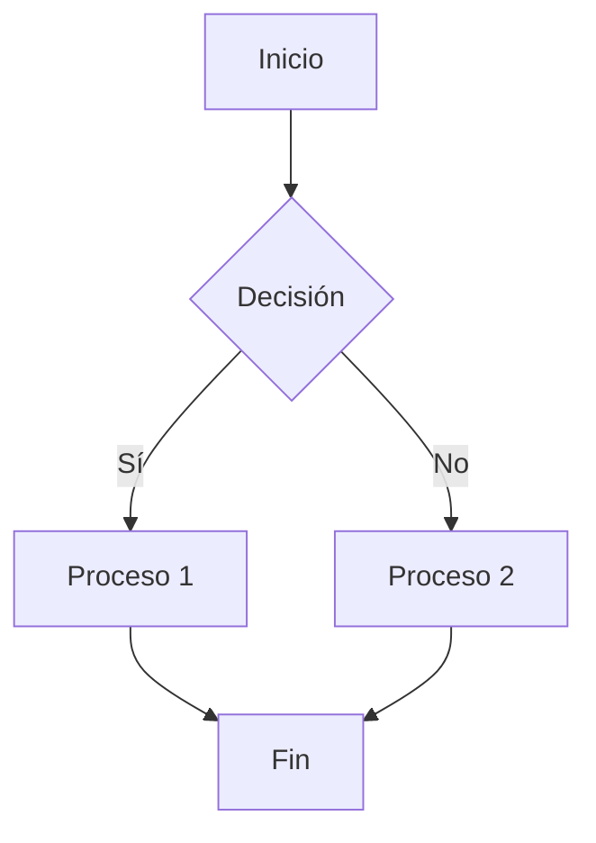
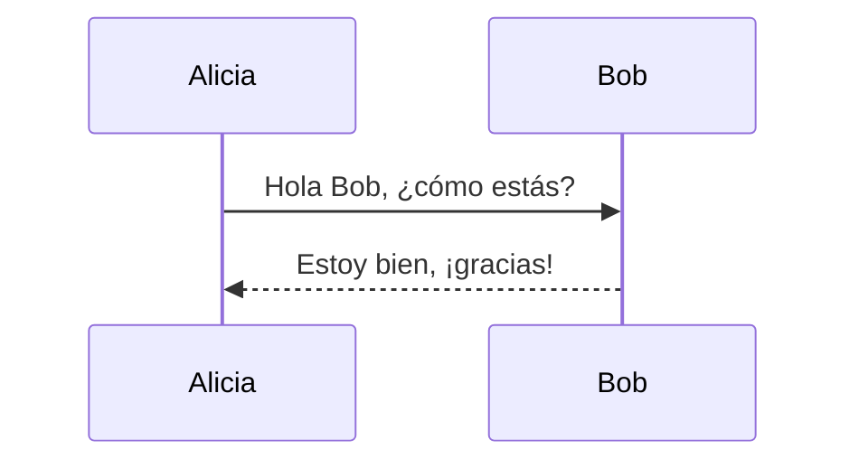
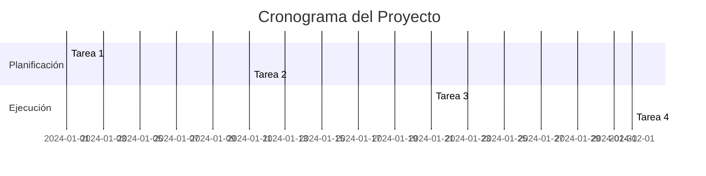

# Archivo de Prueba Markdown

## Encabezado h2

### Encabezado h3

---

## Estilos de Formato

**Texto en negrita**

*Texto en cursiva*

~~Tachado~~

> Esto es una cita en bloque. Puede abarcar múltiples líneas y es útil para enfatizar contenido importante.

Lorem ipsum dolor sit amet, consectetur adipiscing elit. Nulla nec posuere lorem, vel facilisis metus. Integer feugiat auctor lacus, in vulputate justo condimentum non. Vestibulum ante ipsum primis in faucibus orci luctus et ultrices posuere cubilia curae.

---

## Listas

### Lista No Ordenada
- Elemento 1
- Elemento 2
  - Subelemento 2.1
  - Subelemento 2.2
- Elemento 3

### Lista Ordenada
1. Primer elemento
2. Segundo elemento
   1. Subelemento 2.1
   2. Subelemento 2.2
3. Tercer elemento

Lorem ipsum dolor sit amet, consectetur adipiscing elit. Cras ultricies leo ac nunc dignissim, sit amet molestie risus tempor. Aliquam erat volutpat. Mauris aliquet sem in enim fermentum, id scelerisque justo facilisis.

### Lista de Tareas
- [x] Tarea completada
- [ ] Tarea pendiente
- [ ] Otra tarea

---

## Tablas

| Columna 1 | Columna 2 | Columna 3 |
|-----------|-----------|-----------|
| Dato 1    | Dato 2    | Dato 3    |
| Dato A    | Dato B    | Dato C    |

Phasellus tincidunt ex ut eros ultricies, et sagittis ipsum euismod. Sed eget lectus nec nunc sodales tristique. Duis eget purus vel est interdum condimentum.

---

## Bloques de Código

### Código en Línea
Usa `print("Hola, Mundo!")` para imprimir un mensaje en Python.

### Bloque de Código en Python
```python
import numpy as np

def compute_square_matrix(n):
    return np.array([[i * j for j in range(n)] for i in range(n)])

print(compute_square_matrix(5))
```

La programación es una habilidad esencial en los tiempos modernos. Python es un lenguaje versátil que se puede utilizar para diversas aplicaciones, incluyendo ciencia de datos, aprendizaje automático y desarrollo web. Escribir código limpio y eficiente es una habilidad crucial para cualquier desarrollador.

---

## Enlaces e Imágenes

### Hipervínculo
[Visita OpenAI](https://openai.com)

### Imagen


Las imágenes pueden mejorar la documentación al proporcionar representaciones visuales de conceptos. Ayudan a mejorar la legibilidad y comprensión, haciendo que el contenido técnico sea más accesible a una audiencia más amplia.

---

## Reglas Horizontales

---

---

## Ecuaciones Matemáticas

Ecuación en línea: $E = mc^2$

Ecuación en bloque:

$$
\sum_{i=1}^{n} i = \frac{n(n+1)}{2}
$$

La notación matemática es crucial en disciplinas científicas y de ingeniería. Usar ecuaciones en estilo LaTeX en Markdown permite una representación clara y precisa de fórmulas y cálculos.

---

## Notas al Pie

Este es un ejemplo de referencia de nota al pie.[^1]

[^1]: Este es el texto de la nota al pie.

---

## Elementos HTML

<details>
  <summary>Haz clic para expandir</summary>
  ¡Contenido oculto revelado!
</details>

La interactividad en Markdown se puede mejorar usando elementos HTML como secciones expandibles. Esto permite a los usuarios revelar información adicional solo cuando sea necesario, manteniendo los documentos concisos y legibles.

---

## Caracteres de Escape

Para mostrar un `*` o `_` literal, usa una barra invertida: \*escapado\* o \_escapado\_.

Escapar caracteres es importante al escribir en Markdown, especialmente cuando se trabaja con símbolos especiales que tienen significado sintáctico. Garantiza una representación adecuada y evita problemas de formato inesperados.

---

## Diagramas Mermaid

### Diagrama de Flujo


### Diagrama de Secuencia


### Diagrama de Gantt


Los diagramas Mermaid permiten a los usuarios crear diagramas de flujo, diagramas de secuencia, diagramas de Gantt y más dentro de Markdown. Es una herramienta poderosa para la documentación y la visualización de procesos.